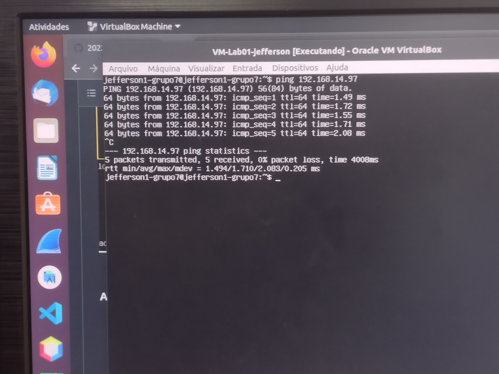
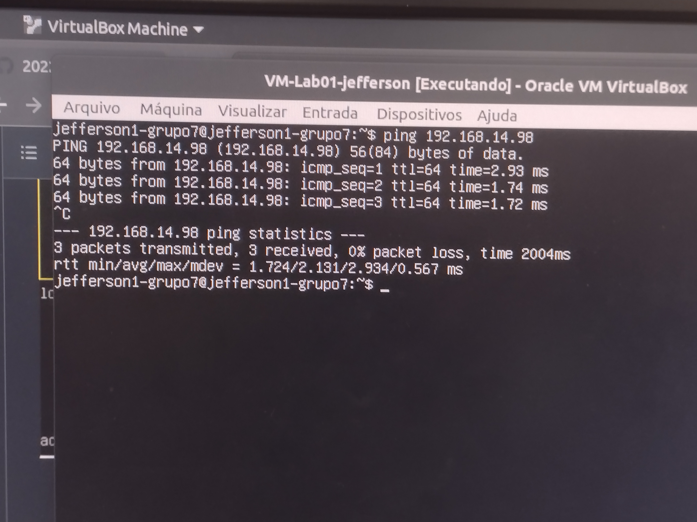
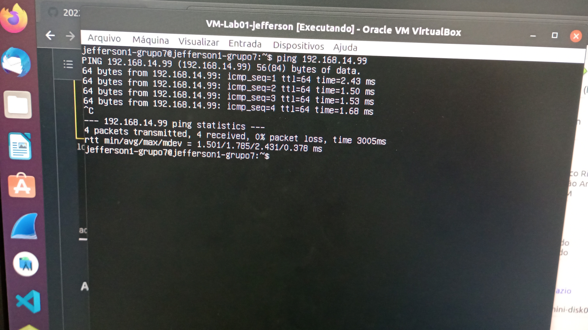
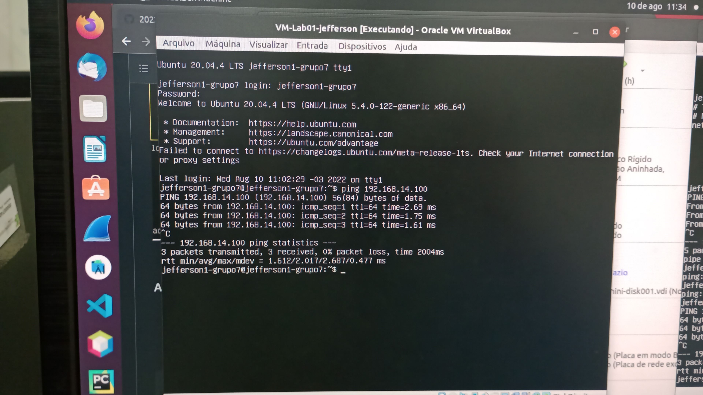
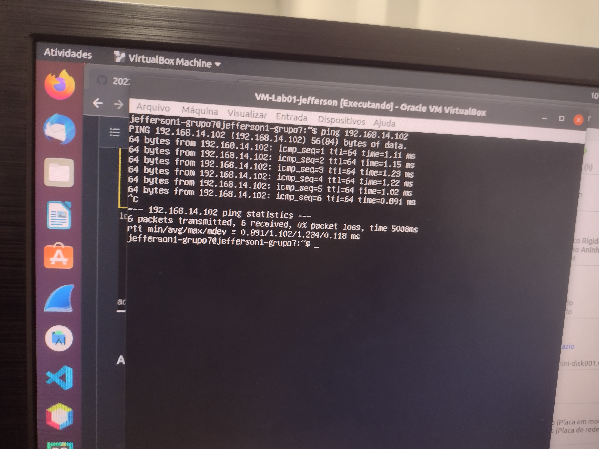

# Testando resultados do projeto.

# 1 passo
## Executar os pings do HostOnly para as outras máquinas.

- Executar o comando ```ping <IP da máquina> ```

### Imagem 1: Teste de ping - Emylle - PC1VM1



### Imagem 2: Teste de ping - Emylle - PC1VM2



### Imagem 3: Teste de ping - Renata - PC2VM1



### Imagem 4: Teste de ping - Renata - PC2VM2



### Imagem 5: Teste de ping - Jefferson - PC3VM2



### Logar nos usuários dos outros integrantes via HostOnly.

### Imagem 6: Logando via HostOnly - Emylle - PC1


### Imagem 7: Logando via HostOnly - Renata - PC2


### Imagem 8: Logando via HostOnly - Jefferson - PC3

