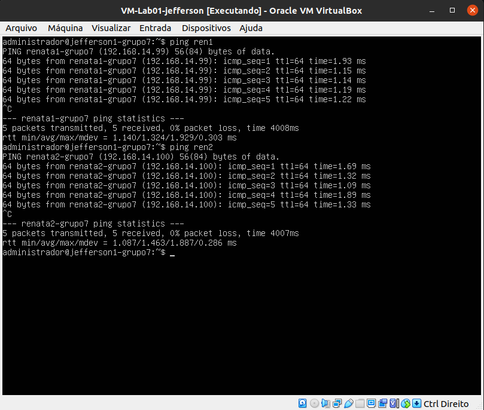

# Testando resultados do projeto.

# 1 passo
## Executar os pings do HostOnly para as outras máquinas.

- Executar o comando ```ping <IP da máquina> ```

### Imagem 1: Teste de ping - Emylle - PC1VM1 e PC1VM2


### Imagem 2: Teste de ping - Renata - PC2VM1 e PC2VM2



### Imagem 3: Teste de ping - Jefferson - PC3VM2


### Imagem 4: Teste de ping - PC4VM1 e PC4VM2


### Logar nos usuários dos outros integrantes via HostOnly.

### Imagem 5: Logando via HostOnly - Emylle - PC1


### Imagem 6: Logando via HostOnly - Renata - PC2


### Imagem 7: Logando via HostOnly - Jefferson - PC3


### Imagem 8: Logando via HostOnly - emylle1-grupo7 para renata2-grupo7


### Imagem 9: Logando via HostOnly - vm2-pc4-grupo7 para jefferson2-grupo7


