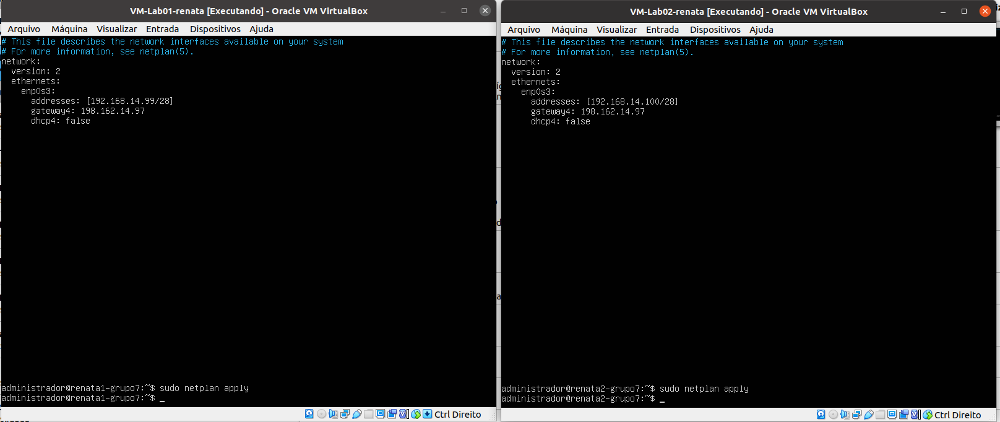
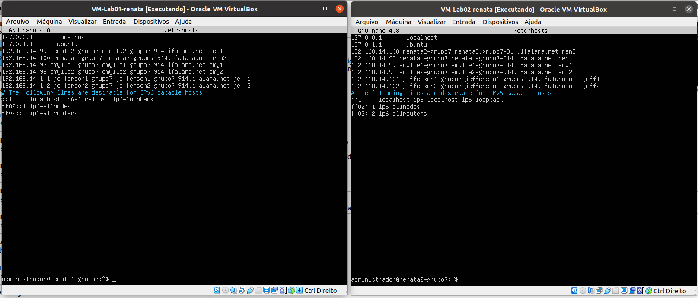

# 1 PASSO
## Importar as ISOS
 - Importar as isos e configurar com o nome dos integrantes do grupo.
 - A iso pode ser baixada pelo Nautilus.
 - 
### Figura 1: Importação da ISO - PC1-Emylle


# 2 PASSO
## Configurar os Ip's no netplan
- Abrir as VMs e fazer login no ```administrador```
- Senha: ```adminifal```

### Para acessar o netplan:
- Executar o comando.

```
sudo nano /etc/netplan/01-netcfg.yaml
```
- Se não possuir o arquivo verificar o nome dele com ``` ls -la /etc/netplan ```
- Retirar o renderer.
- Adicionar o gateway4 e o addresses com os IP's da equipe.
- Adicionar dhcp4: false

### Figura 2: Arquivo netplan - PC1 - Emylle


### Figura 3: Arquivo netplan - PC2 - Renata



### Figura 4: Arquivo netplan - PC3 - Jefferson


- Por fim, executar ``` sudo netplan apply ```
- Verificar no ``` ifconfig -a ``` se alterações foram aplicadas.
 
### Figura 5: Ifconfig - PC2 - Renata


- Caso o comando não exista, executar ``` sudo apt install net-tools```

# 3 PASSO
## Configurar o SSH
### Adicionando os Hostnames 
- Executar o comando ```sudo hostnamectl set-hostname <hostname> ``` com os nomes dos integrantes do grupo definidos pela tabela.
- Mudar as configurações de IP e a rede para NAT 

### Figura 6: Configurações de rede - PC1 - Emylle


- Executar os comandos ```sudo apt update e sudo apt upgrade -y``` para verificar se as máquinas estão tendo acesso à internet.
### Figura 7: Upgrade - PC1 - Emylle


- Instalar o SSH com os comandos ```sudo apt-get install openssh-serve``` e ```systemctl status ssh```

### Figura 8: Instalando o ssh - PC2 - Renata


### Figura 9: Instalando o ssh - PC3 - Jefferson


- Verificar o status e ver se a Porta 22 está ouvindo com o comando ```netstat -an | grep LISTEN.```
### Figura 10: Verificando status SSH - PC1 - Emylle


### Figura 11: Verificando status SSH - PC2 - Renata


- Configurar o Firewall com os comandos ```sudo ufw allow ssh``` e ```sudo ufw status```
- Em seguida, ativar o Firewall com  ```sudo ufw enable```

### Figura 12: Verificando status Firewall - PC 1 - Emylle


### Figura 13: Verificando status Firewall - PC 2 - Renata


### Figura 14: Verificando status Firewall - PC 3 - Jefferson


## 4 PASSO
### Criar os users com o hostname dos integrantes do grupo
- Crie os users com o comando ```sudo adduser``` <nomedosintegrantes>
- Adicione as informações que a máquina exigir

### Figura 15: Criando users - PC 2 - Renata

 
### Figura 16: Users criados - PC 1 - Emylle


### Figura 17: Users criados - PC 2 - Renata

 
### Figura 18: Users criados - PC 3 - Jefferson


- Modificar o arquivo de hosts utilizando o comando ```sudo nano /etc/hosts```
- Deve obedecer os seguintes formatos: <hostname/ip/dominio/aliase>

### Figura 19: Config de host - PC 1 - Emylle


### Figura 20: Config de host - PC 2 - Renata


### Figura 21: Config de host - PC 3 - Jefferson


- Colocar as configurações de rede em Modo Bridge
- Verificar se os endereços MAC's não estão iguais

### Figura 22: Endereço MAC e modo bridge - PC 1 VM1- Emylle


### Figura 23: Endereço MAC e modo bridge - PC 1 VM2- Emylle


### Figura 24: Endereço MAC e modo bridge - PC 2 VM1- Renata


## 5 PASSO - ATIVAR O HOST ONLY
 - Ativar a interface no computador para a comunicação Host-VM
 - Configurar o servidor DCHP do adaptador VnetBox0
 
 ### Figura 25: DHCP - PC 3 - Jefferson
 

 
  ### Figura 26: Vnetbox0 - PC 3 - Jefferson
 
 
 - Ativar as configurações da interface na VM para o servidor dhcp para o adaptador 2 (enp0s8)
 
 ### Figura 27: enp0s8 - PC 3 - Jefferson
 
 
