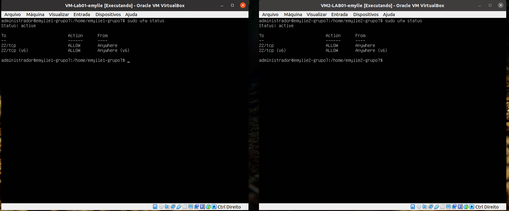
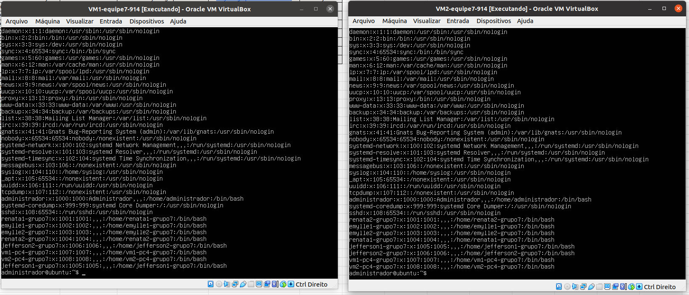

# PLANEJAMENTO
```
Tabela 1: Planilha de IP's
-------------------------------------------------------------------------------------------------------------------------------------------
|  DESCRICAO                    |          IP            |     hostname             |          FQDN                     |      aliase      |
-------------------------------------------------------------------------------------------------------------------------------------------|
| PC1-GRUPO7-VMLab01-Emylle     | 192.168.14.97/28       |    emylle1-grupo7        | emylle1.grupo7-914.ifalara.net    |       emy1       |
| PC1-GRUPO7-VM2Lab01-Emylle    | 192.168.14.98/28       |    emylle2-grupo7        | emylle2.grupo7-914.ifalara.net    |       emy2       |
| PC2-GRUPO7-VMLab01-Renata     | 192.168.14.99/28       |    renata1-grupo7        | renata1.grupo7-914.ifalara.net    |       ren1       |
| PC2-GRUPO7-VMLab02-Renata     | 192.168.14.100/28      |    renata2-grupo7        | renata2.grupo7-914.ifalara.net    |       ren2       |
| PC3-GRUPO7-VMLab01-Jefferson  | 192.168.14.101/28      |    jefferson1-grupo7     | jefferson1.grupo7-914.ifalara.net |       jef1       |
| PC3-GRUPO7-VMLab02-Jefferson  | 192.168.14.102/28      |    jefferson2-grupo7     | jefferson2.grupo7-914.ifalara.net |       jef2       |
| PC4-GRUPO7-VM1-equipe7-914    | 192.168.14.103/28      |    vm1-pc4-grupo7        | vm1-pc4.grupo7-914.ifalara.net    |       vm1        |
| PC4-GRUPO7-VM1-equipe7-914    | 192.168.14.104/28      |    vm2-pc4-grupo7        | vm2-pc4.grupo7-914.ifalara.net    |       vm2        |
--------------------------------------------------------------------------------------------------------------------------------------------
```
# EXECUÇÃO
# 1 PASSO
## Importar as ISOS
 - Importar as isos e configurar com o nome dos integrantes do grupo.
 - A iso pode ser baixada pelo Nautilus.
### Figura 1: Importação da ISO - PC1-Emylle


# 2 PASSO
## Configurar os IP's no netplan
- Abrir as VMs e fazer login no ```administrador```
- Senha: ```adminifal```

### Para acessar o netplan:
- Executar o comando.

```
sudo nano /etc/netplan/01-netcfg.yaml
```

- Se não possuir o arquivo verificar o nome dele com ``` ls -la /etc/netplan ```
- Retirar o renderer.
- Adicionar o gateway4 e o addresses com os IP's da equipe.
- Adicionar dhcp4: false

### Figura 2: Arquivo netplan - PC1 - Emylle


### Figura 3: Arquivo netplan - PC2 - Renata


### Figura 4: Arquivo netplan - PC3 - Jefferson


### Figura 5: Arquivo netplan - PC4


- Por fim, executar ``` sudo netplan apply ```
- Verificar no ``` ifconfig -a ``` se alterações foram aplicadas.
 
### Figura 6: Ifconfig - PC2 - Renata


### Figura 7: Ifconfig - PC3 - Jefferson


- Caso o comando não exista, executar ``` sudo apt install net-tools```

# 3 PASSO
## Configurar o SSH
### Adicionando os Hostnames 
- Executar o comando ```sudo hostnamectl set-hostname <hostname> ``` com os nomes dos integrantes do grupo definidos pela tabela.
- Seguir a planilha: https://github.com/renatabfs/redes/blob/main/planilha.md

### Figura 8: Adicionando os Hosts no PC4

     
- Mudar as configurações de IP e a rede para NAT .

### Figura 9: Configurações de rede - PC1 - Emylle


### Figura 10: Configurações de rede - PC2 - Renata


- Executar os comandos ```sudo apt update e sudo apt upgrade -y``` para verificar se as máquinas estão tendo acesso à internet.
### Figura 11: Upgrade - PC1 - Emylle


- Instalar o SSH com os comandos ```sudo apt-get install openssh-server``` e ```systemctl status ssh```

### Figura 12: Instalando o ssh - PC2 - Renata


### Figura 13: Instalando o ssh - PC3 - Jefferson


- Verificar o status e ver se a Porta 22 está ouvindo com o comando ```netstat -an | grep LISTEN.```
### Figura 14: Verificando status SSH - PC1 - Emylle


### Figura 15: Verificando status SSH - PC2 - Renata


### Figura 16: Verificando status SSH - PC4


- Configurar o Firewall com os comandos ```sudo ufw allow ssh``` e ```sudo ufw status```
- Em seguida, ativar o Firewall com  ```sudo ufw enable```

### Figura 16: Verificando status Firewall - PC 1 - Emylle


### Figura 17: Verificando status Firewall - PC 2 - Renata


### Figura 18: Verificando status Firewall - PC 3 - Jefferson


### Figura 19: Verificando status Firewall - PC 4


## 4 PASSO
### Criar os users com o hostname dos integrantes do grupo.
- Crie os users com o comando ```sudo adduser``` <nomedosintegrantes>
- Pode ser usado o mesmo nome de usuário que os hostname's da planilha fornecida.
- Adicione as informações que a máquina exigir.

### Figura 20: Criando users - PC 2 - Renata

 
 ### Figura 21: Criando users - PC 4

 
### Figura 22: Users criados - PC 1 - Emylle


### Figura 23: Users criados - PC 2 - Renata

 
### Figura 24: Users criados - PC 3 - Jefferson

                                                    
## Figura 25: Users criados - PC 4


- Modificar o arquivo de hosts utilizando o comando ```sudo nano /etc/hosts```
- Deve obedecer os seguintes formatos: <hostname/ip/dominio/aliase>

### Figura 26: Config de host - PC 1 - Emylle


### Figura 27: Config de host - PC 2 - Renata


### Figura 28: Config de host - PC 3 - Jefferson

 
 ### Figura 29: Config de host - PC 4


- Colocar as configurações de rede em Modo Bridge
- Verificar se os endereços MAC's não estão iguais

### Figura 30: Endereço MAC e modo bridge - PC 1 VM1- Emylle


### Figura 31: Endereço MAC e modo bridge - PC 1 VM2- Emylle


### Figura 32: Endereço MAC e modo bridge - PC 2 VM1- Renata

 
 ### Figura 33: Endereço MAC e modo bridge - PC 4 VM1


### Figura 34: Endereço MAC e modo bridge - PC 4 VM2


## 5 PASSO - ATIVAR O HOST ONLY
 - Ativar a interface no computador para a comunicação Host-VM
 - Configurar o servidor DCHP do adaptador VnetBox0
 
 ### Figura 35: DHCP - PC 3 - Jefferson
 

 
  ### Figura 38: Vnetbox0 - PC 3 - Jefferson
 
 
 - Ativar as configurações da interface na VM para o servidor dhcp para o adaptador 2 (enp0s8)
 
 ### Figura 39: enp0s8 - PC 3 - Jefferson
 
 
